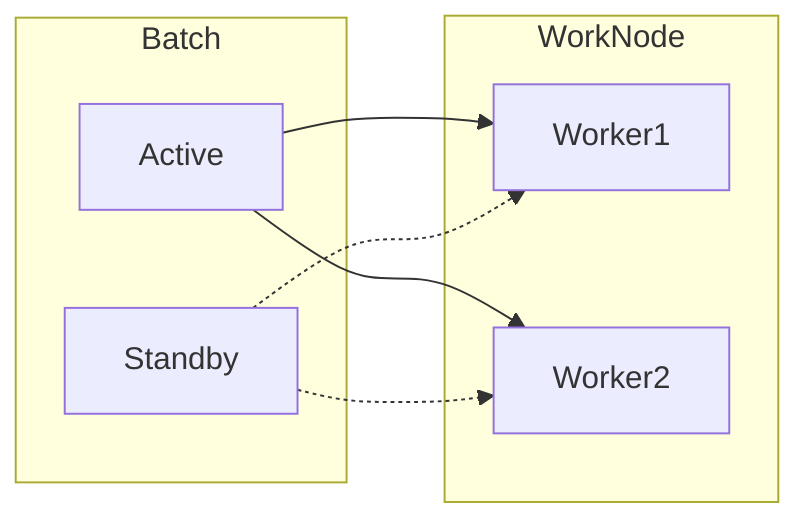

## mermaid sample

```mermaid
graph LR
  subgraph Batch
      A[Active]
      S[Standby]
  end
  subgraph WorkNode
      W1[Worker1]
      W2[Worker2]
  end

  A --> W1
  A --> W2

  S -.-> W1
  S -.-> W2

```
